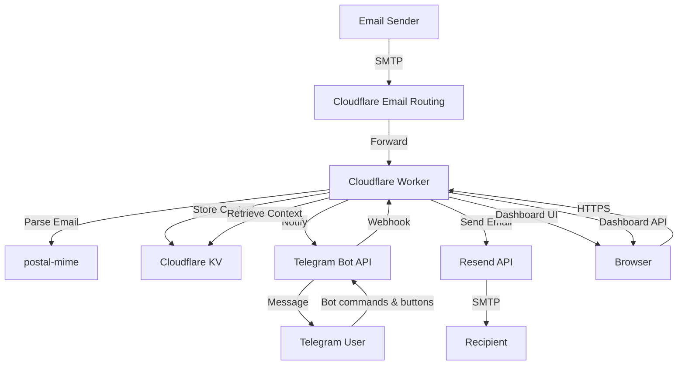

# Cloudflare Email-to-Telegram Worker

A serverless email bridge that forwards incoming emails to a Telegram bot, allows you to reply/forward/compose directly from Telegram, and includes a web dashboard at `/dashboard`. Built with Cloudflare Workers, Cloudflare Email Routing, Resend, and the Telegram Bot API.

## Features

- **Inbound Forwarding**: Receive emails at your custom domain and get instant Telegram notifications.
- **Attachment Support**: Automatically forwards email attachments to your Telegram chat.
- **Telegram Bot**: Reply, forward, and compose new emails directly from Telegram with guided flows and inline buttons.
- **Web Dashboard**: Password-protected inbox at `email.yourdomain.com/dashboard` — read, delete, reply, and compose emails from a browser.
- **Outbound via Resend**: Sends email through Resend for reliable delivery to any address.
- **Serverless**: Runs on Cloudflare Workers — zero infrastructure management.

## Architecture



## Dashboard

The worker serves a built-in web dashboard at `/dashboard` (e.g., `https://email.yourdomain.com/dashboard`).

- Login with the `DASHBOARD_API_KEY` secret
- Read, delete, reply, and compose emails
- Mobile-responsive with read/unread tracking

The dashboard API is also available at `/api/*` for custom integrations:

| Method | Path | Description |
|--------|------|-------------|
| GET | `/api/emails` | List all emails |
| GET | `/api/emails/:id` | Get a single email |
| DELETE | `/api/emails/:id` | Delete an email |
| POST | `/api/emails/send` | Send an email |
| GET | `/api/settings` | Get settings |
| POST | `/api/settings` | Update settings |

All API requests require `Authorization: Bearer <DASHBOARD_API_KEY>`.

## Prerequisites

- A domain managed by Cloudflare
- Cloudflare Workers account
- A Telegram Bot (created via @BotFather)
- Your Telegram Chat ID (retrieve via @userinfobot)
- A [Resend](https://resend.com) account with your domain verified

## Installation and Setup

### 1. Clone and Install Dependencies

```bash
git clone <repository-url>
cd mail
pnpm install
```

### 2. Configure Cloudflare KV

Create a KV namespace for storing email context:

```bash
npx wrangler kv namespace create EMAIL_STORE
```

Update `wrangler.jsonc` with the returned namespace ID.

### 3. Set Secrets

```bash
npx wrangler secret put TELEGRAM_BOT_TOKEN
npx wrangler secret put TELEGRAM_CHAT_ID
npx wrangler secret put DASHBOARD_API_KEY   # choose a strong password
npx wrangler secret put RESEND_API_KEY      # from resend.com/api-keys
```

### 4. Verify Your Sending Domain on Resend

1. Go to [resend.com/domains](https://resend.com/domains) and add your domain.
2. Add the DNS records Resend provides (SPF, DKIM).
3. Wait for verification before deploying.

### 5. Deploy to Cloudflare

```bash
pnpm run deploy
```

### 6. Register Telegram Webhook

```bash
curl -X POST "https://api.telegram.org/bot<YOUR_BOT_TOKEN>/setWebhook" \
  -d "url=https://<your-worker-url>/telegram-webhook"
```

### 7. Configure Email Routing

1. In the Cloudflare Dashboard, go to **Email > Email Routing**.
2. Enable Email Routing for your domain.
3. Add a Catch-all rule: **Send to Worker** → select your mail worker.

## Telegram Bot Commands

| Command | Description |
|---------|-------------|
| `/reply <id>` | Reply to an email |
| `/forward <id>` | Forward an email |
| `/send` | Compose a new email |
| `/recent` | Show last 5 emails with reply/forward buttons |
| `/recent <n>` | Show last N emails (max 10) |
| `/settings` | Configure auto-forward |
| `/cancel` | Cancel current draft |

All send flows show a preview with inline buttons before sending. Attachments can be added via the 📎 button.

## Development

```bash
pnpm dev
```

## Dependencies

- **postal-mime** — Parse inbound MIME messages
- **wrangler** — Cloudflare Workers CLI

## License

MIT
