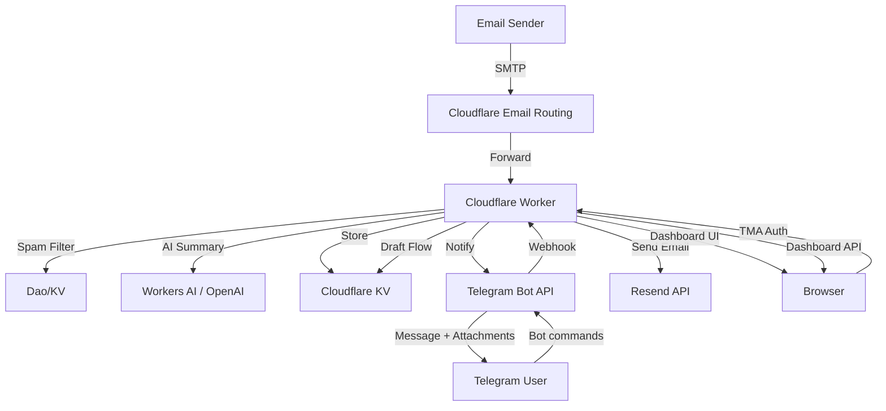

# Ultimate Cloudflare Email-to-Telegram Bridge

An advanced, serverless email bridge that forwards incoming emails to a Telegram bot with AI summarization, native attachment support, and a rich web dashboard.

[](https://opensource.org/licenses/MIT)
[](https://workers.cloudflare.com/)

## Features

- **Inbound Forwarding**: Receive emails at your custom domain and get instant Telegram notifications.
- **AI Summarization**: Automatically generates concise summaries using Cloudflare Workers AI or OpenAI.
- **Attachment Support**: Forwards files, photos, and documents directly to your Telegram chat.
- **Spam Protection**: Advanced regex-based whitelist and blacklist management.
- **Web Dashboard**: Passwordless, mobile-responsive inbox at /dashboard secured by Telegram Auth.
- **Interactive Bot**: Reply, forward, and compose emails directly via Telegram guided flows.
- **Outbound Sending**: Professional email delivery via the Resend API.

---

## Architecture



---

## Installation

### Prerequisites
- A domain managed by Cloudflare.
- A Cloudflare Workers account.
- A Telegram Bot token from @BotFather.
- Your Telegram Chat ID from @userinfobot.
- A Resend API Key for sending emails.

### Step-by-Step Setup

1. **Clone & Install**
   ```bash
   pnpm install
   cp wrangler.example.jsonc wrangler.jsonc
   cp .dev.vars.example .dev.vars
   ```

2. **Database Setup**
   Create a KV namespace for storing emails and draft states:
   ```bash
   npx wrangler kv namespace create EMAIL_STORE
   ```
   Copy the ID into your `wrangler.jsonc`:
   ```jsonc
   "kv_namespaces": [
     { "binding": "EMAIL_STORE", "id": "YOUR_KV_ID" }
   ]
   ```

3. **Configure Secrets**
   Set the following encrypted variables in Cloudflare:
   ```bash
   npx wrangler secret put TELEGRAM_BOT_TOKEN
   npx wrangler secret put TELEGRAM_CHAT_ID
   npx wrangler secret put RESEND_API_KEY
   npx wrangler secret put OPENAI_API_KEY # Optional
   ```

4. **Deploy**
   ```bash
   pnpm run deploy
   ```

5. **Verification**
   Initialize the bot by visiting:
   `https://your-worker-domain.com/init`
   *You should see a JSON response confirming the webhook and commands are set.*

---

## Usage

### Telegram Bot
- **NATIVE REPLY**: Simply swipe and reply to any email notification to send a quick response.
- **COMMANDS**:
    - /send: Start a 3-step guided flow to compose a new email.
    - /forward <id>: Forward a specific email to another address.
    - /inbox: Browse your 30-day history with pagination.
    - /block / /white: Open the Mini App to manage regex filters.

### Web Dashboard
Access your inbox at `https://your-worker-domain.com/dashboard`.
- **Auth**: No login required if opened from within the Telegram "Open Manager" button.
- **Features**: Search, delete, and compose emails with a rich text interface.

---

## API Reference

The Dashboard API is available for custom integrations. All requests must include `Authorization: tma <INIT_DATA>`.

| Method | Endpoint | Description |
|:--- | :--- | :--- |
| `GET` | `/api/emails` | List all cached emails. |
| `GET` | `/api/emails/:id` | Get full JSON content of an email. |
| `DELETE` | `/api/emails/:id` | Permanently delete an email from KV. |
| `POST` | `/api/emails/send` | Send a new email via Resend. |
| `GET` | `/api/address/list` | Get current Block/White lists. |

---

## Configuration

| Variable | Default | Description |
|:--- | :--- | :--- |
| `DOMAIN` | `""` | Your worker's custom domain or workers.dev URL. |
| `FORWARD_EMAIL` | `""` | A fallback email to receive copies of all incoming mail. |
| `MAIL_TTL` | `2592000` | Retention in seconds (default 30 days). |
| `WORKERS_AI_MODEL`| `""` | Cloudflare AI model (e.g. @cf/meta/llama-3-8b-instruct). |
| `GUARDIAN_MODE` | `false` | If true, applies strict filtering before notifying Telegram. |

---

## Troubleshooting

- **"Unauthorized" in Dashboard**: Ensure you are opening the link from inside Telegram or that your TELEGRAM_BOT_TOKEN is correct.
- **Emails not arriving**: Check Email Routing in the Cloudflare Dashboard and ensure the "Catch-all" is pointing to your worker.
- **AI Summary failing**: Verify that you have the AI binding in wrangler.jsonc and that your account has access to Workers AI.

---

## Acknowledgments
This project is heavily inspired by and based upon the excellent work from [TBXark/mail2telegram](https://github.com/tbxark/mail2telegram).

---

## License
Released under the [MIT License](LICENSE).
