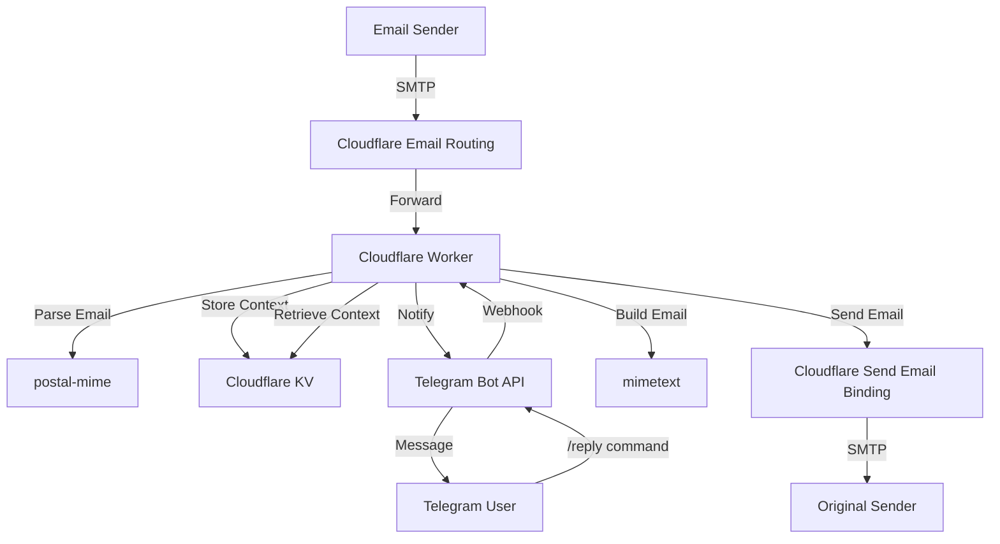

# Cloudflare Email-to-Telegram Worker

A serverless email bridge that forwards incoming emails to a Telegram bot and allows you to reply directly from Telegram. Built with Cloudflare Workers, Cloudflare Email Routing, and the Telegram Bot API.

## Features

- **Inbound Forwarding**: Receive emails at your custom domain and get instant Telegram notifications.
- **Attachment Support**: Automatically forwards email attachments to your Telegram chat.
- **Telegram Replies**: Reply to forwarded emails using a simple /reply command in Telegram.
- **Serverless**: Runs on Cloudflare Workers for global low-latency and zero infrastructure management.
- **Secure**: Uses Cloudflare KV for storing email context and secrets for bot authentication.

## Architecture



## Prerequisites

- A domain managed by Cloudflare.
- Cloudflare Workers account.
- A Telegram Bot (created via @BotFather).
- Your Telegram Chat ID (can be retrieved via @userinfobot).

## Installation and Setup

### 1. Clone and Install Dependencies

```bash
git clone <repository-url>
cd mail
pnpm install
```

### 2. Configure Cloudflare KV

Create a KV namespace for storing email context:

```bash
npx wrangler kv namespace create EMAIL_STORE
```

Update your wrangler.jsonc with the returned id.

### 3. Set Environment Secrets

Configure your Telegram credentials:

```bash
npx wrangler secret put TELEGRAM_BOT_TOKEN
npx wrangler secret put TELEGRAM_CHAT_ID
```

### 4. Deploy to Cloudflare

```bash
npx wrangler deploy
```

Take note of your deployed Worker URL (e.g., https://mail.<your-subdomain>.workers.dev).

### 5. Register Telegram Webhook

Link your Telegram bot to your worker:

```bash
curl -X POST "https://api.telegram.org/bot<YOUR_BOT_TOKEN>/setWebhook" \
  -d "url=https://<your-worker-url>/telegram-webhook"
```

### 6. Configure Email Routing

1. In the Cloudflare Dashboard, go to Email > Email Routing.
2. Enable Email Routing for your domain.
3. Add a Catch-all rule:
   - Action: Send to Worker
   - Worker: Select your mail worker.
4. (Optional) Add a Verified destination address if you plan to send emails from a specific address.

## Usage

### Receiving Emails
Any email sent to your domain (e.g., hello@yourdomain.com) will be parsed by the worker and forwarded to your Telegram chat. The notification will include the sender, subject, and body snippet.

### Replying via Telegram
To reply to an email, use the /reply command followed by the message ID (provided in the notification) and your message:

```text
/reply <msg_id> Hello! Thank you for your email. I will get back to you soon.
```

The worker will look up the original sender\'s details in KV, construct a professional email reply, and send it using Cloudflare\'s send_email binding.

## Development

Run the worker locally for testing:

```bash
pnpm dev
```

## Dependencies

- postal-mime: For parsing complex MIME messages.
- mimetext: For constructing compliant email messages.
- wrangler: Cloudflare Workers CLI.

## License

MIT
